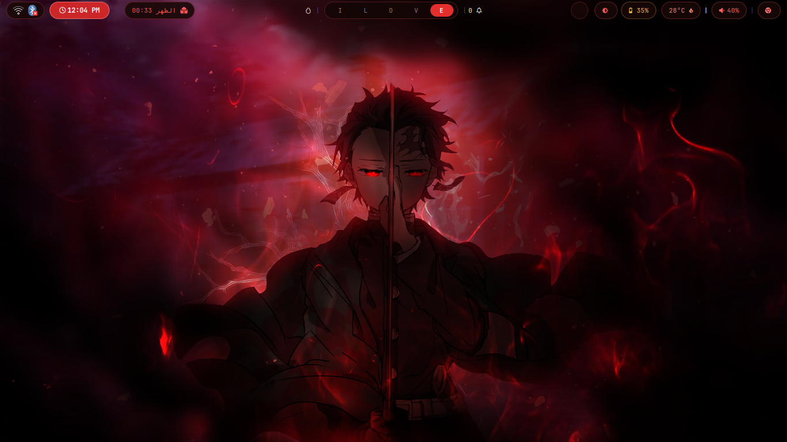
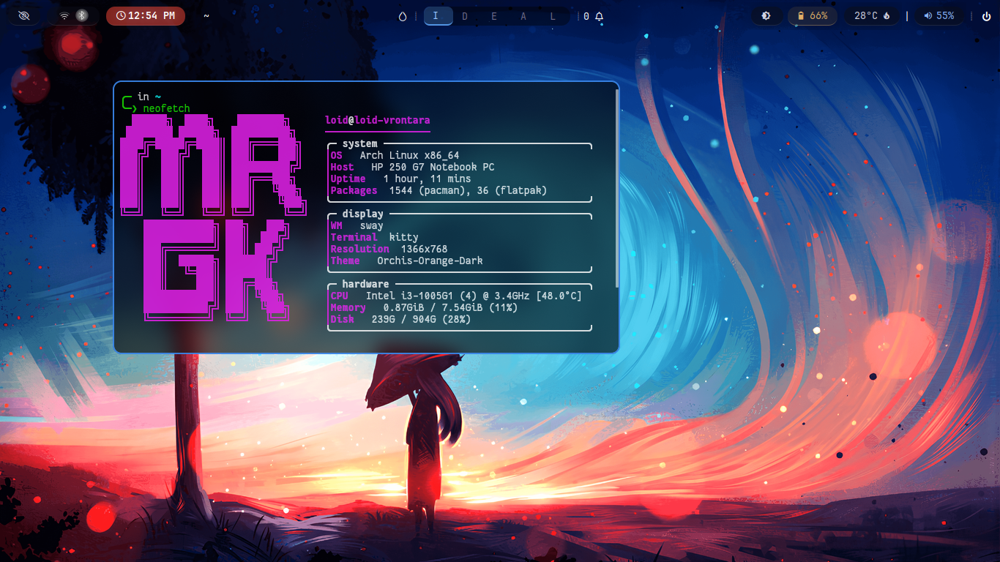
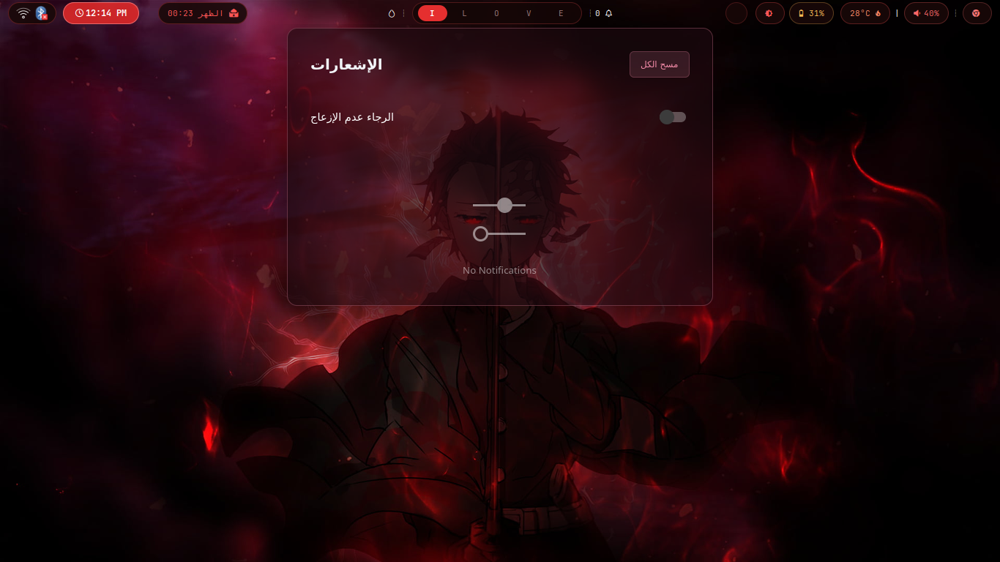

# A-hyprland

My personal Hyprland configuration files.



---

## Contents

| Config | Description |
|--------|-------------|
| `hypr` | Hyprland window manager config |
| `waybar` | Status bar |
| `kitty` | Terminal emulator |
| `fuzzel` | App launcher |
| `neofetch` | System info display |

---

## Requirements

Make sure **Hyprland** is installed before running the install script.

```bash
sudo pacman -S hyprland
```

---

## Install

```bash
git clone https://github.com/njds82/A-hyprland.git
cd A-hyprland
chmod +x install.sh
./install.sh
```

The script will:
- Install required packages (waybar, kitty, fuzzel, neofetch, swaync, blueman, network-manager-applet, awww, polkit-gnome, brightnessctl, playerctl, pipewire, grimblast, nemo)
- Copy configs to `~/.config/`
- Back up any existing configs automatically
- Copy wallpaper to `~/.config/hypr/wallpaper.png`

---

## Keybindings

> `Super` = Windows key

### General

| Keybind | Action |
|---------|--------|
| `Super + Q` | Open terminal (kitty) |
| `Super + E` | Open file manager (nemo) |
| `Super + R` | Open app launcher (fuzzel) |
| `Super + C` | Close active window |
| `Super + M` | Exit Hyprland |
| `Super + V` | Toggle floating |
| `Super + P` | Toggle pseudotile |
| `Super + J` | Toggle split |
| `Super + N` | Toggle notification center |
| `Super + Space` | Switch keyboard layout (EN/AR) |

### Focus

| Keybind | Action |
|---------|--------|
| `Super + ←` | Move focus left |
| `Super + →` | Move focus right |
| `Super + ↑` | Move focus up |
| `Super + ↓` | Move focus down |

### Workspaces

| Keybind | Action |
|---------|--------|
| `Super + 1..0` | Switch to workspace 1–10 |
| `Super + Shift + 1..0` | Move window to workspace 1–10 |
| `Super + S` | Toggle scratchpad |
| `Super + Shift + S` | Move window to scratchpad |
| `Super + Scroll Up` | Next workspace |
| `Super + Scroll Down` | Previous workspace |

### Mouse

| Keybind | Action |
|---------|--------|
| `Super + LMB drag` | Move window |
| `Super + RMB drag` | Resize window |

### Screenshots

| Keybind | Action |
|---------|--------|
| `Print` | Copy full screen |
| `Shift + Print` | Copy selected area |
| `Alt + Print` | Copy active window |

### Media & Hardware

| Keybind | Action |
|---------|--------|
| `Volume Up` | +5% volume |
| `Volume Down` | -5% volume |
| `Mute` | Toggle mute |
| `Mic Mute` | Toggle mic mute |
| `Brightness Up` | +5% brightness |
| `Brightness Down` | -5% brightness |
| `Next` | Next track |
| `Play/Pause` | Play/Pause |
| `Prev` | Previous track |

---

## Screenshots





---

## Notes

- Built for **Arch Linux**
- No display manager — logs in directly from TTY
- Tested on Hyprland 0.54+
